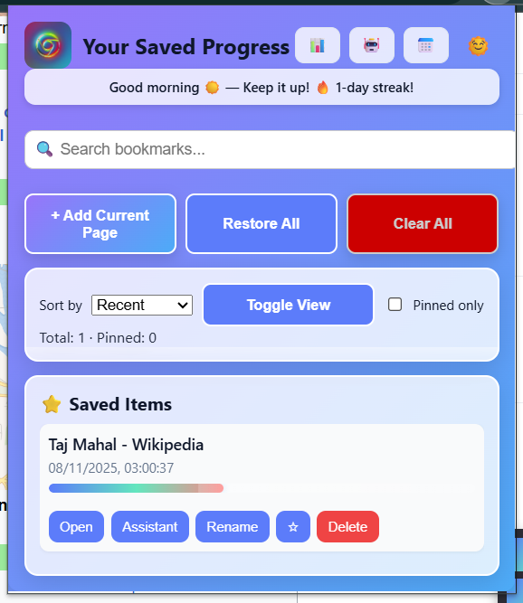

# NOTIFY-Progress Tracker

  
*A smart Chrome extension for tracking reading progress, summarizing content, and managing bookmarks with AI-powered features.*

## 📖 Overview

Vibrant Progress Tracker is a powerful Chrome extension designed to help users track their reading progress across web pages, save bookmarks with scroll positions, and leverage AI for content summarization, rewriting, translation, and more. Built with modern web technologies, it integrates Chrome's built-in AI APIs (where available) and falls back to external services like Gemini for seamless functionality.

The extension includes features like live progress tracking, a floating widget, daily reminders, a calendar for task scheduling, and an assistant modal for AI-driven content processing. It's perfect for students, researchers, and avid readers who want to stay organized and productive.

### Key Highlights
- **Progress Tracking**: Automatically saves scroll positions and displays progress bars.
- **AI Integration**: Summarize, rewrite, translate, and generate content using Chrome's AI or Gemini API.
- **User-Friendly UI**: Dark/light theme toggle, responsive design, and intuitive modals.
- **Cross-Platform**: Works on any website, with special support for YouTube videos.
- **Privacy-Focused**: Processes content locally where possible; no data sent without user consent.

### 🏗️ Architecture Visualization

Here's a high-level visualization of the extension's architecture:

<pre>
+-------------------+     +-------------------+     +-------------------+
|   Popup UI        |     |   Background      |     |   Content Scripts |
|   (popup.html/js) |<--->|   Service Worker  |<--->|   (content.js)    |
|   - Bookmarks     |     |   (background.js) |     |   - Scroll Track  |
|   - Assistant     |     |   - Alarms        |     |   - Floating Widget|
|   - Calendar      |     |   - Storage       |     |   - Progress Bar  |
+-------------------+     +-------------------+     +-------------------+
          |                         |                         |
          v                         v                         v
+-------------------+     +-------------------+     +-------------------+
|   AI Services     |     |   Chrome APIs     |     |   Web Page        |
|   (ai-service.js) |     |   - Tabs          |     |   - DOM Access    |
|   - Gemini API    |     |   - Storage       |     |   - Scroll Events |
|   - Built-in AI   |     |   - Notifications |     |   - Media Playback|
+-------------------+     +-------------------+     +-------------------+
</pre>


- **Popup UI**: The main interface for managing bookmarks, accessing the assistant, and viewing the calendar.
- **Background Service Worker**: Handles alarms, notifications, storage, and message passing.
- **Content Scripts**: Injects features like progress tracking and floating widgets into web pages.
- **AI Services**: Provides summarization, rewriting, etc., with fallbacks.
- **Chrome APIs**: Leverages tabs, storage, and notifications for core functionality.

## ✨ Features

### Core Functionality
- **📘 Progress Tracking**: Saves scroll positions and displays live progress bars on pages.
- **🔖 Bookmark Management**: Add, edit, delete, and pin bookmarks with metadata (e.g., YouTube timestamps).
- **📊 Dashboard**: View stats like total bookmarks, pinned items, and streaks.
- **🔔 Daily Reminders**: Configurable notifications to encourage reading habits.
- **📅 Calendar Integration**: Schedule tasks and view them in a built-in calendar.

### AI-Powered Features
- **🧠 Summarization**: Extract key points from pages or selected text (supports bullet points, short/long summaries).
- **✏️ Rewriting & Proofreading**: Improve text clarity, tone, or style.
- **🌐 Translation**: Translate content into 50+ languages.
- **📝 Content Generation**: Create original text based on prompts (e.g., LinkedIn posts, study notes).
- **🤖 Assistant Modal**: Interactive tool for all AI operations with caching for performance.

### UI/UX Enhancements
- **🌙 Dark/Light Theme**: Toggle themes with smooth animations.
- **⚡ Floating Widget**: Quick-access buttons for saving, summarizing, and opening bookmarks.
- **🔍 Search & Filters**: Search bookmarks and filter by progress or pinned status.
- **📱 Responsive Design**: Works on mobile and desktop Chrome.
- **🎨 Customizable**: Options page for settings like reminder times.

### Advanced Features
- **YouTube Support**: Tracks video progress and extracts transcripts.
- **Batch Processing**: Handle multiple AI operations efficiently.
- **Fallback Mechanisms**: Graceful degradation if AI APIs are unavailable.
- **Startup Summary**: Displays progress recap on Chrome launch.

## 🚀 Installation

### Prerequisites
- **Chrome Version**: 120+ (for built-in AI APIs).
- **Permissions**: The extension requires access to tabs, storage, and notifications. It does not collect personal data.

### Steps
1. **Download the Extension**:
   - Clone or download the repository:  
     `git clone https://github.com/yourusername/vibrant-progress-tracker.git`  
     Or download the ZIP and extract it.

2. **Load in Chrome**:
   - Open Chrome and go to `chrome://extensions/`.
   - Enable "Developer mode" (top-right toggle).
   - Click "Load unpacked" and select the extension folder.

3. **Enable AI Features** (Optional but Recommended):
   - Go to `chrome://flags/` and enable `#chrome-ai`, `#chrome-ai-prompt`, etc.
   - Alternatively, in `chrome://settings/` → Privacy and security → Site Settings, enable "Experimental AI features."
   - Restart Chrome.

4. **Set Up API Key** (for Gemini Fallback):
   - Edit `ai.js` and replace `GEMINI_API_KEY` with your Gemini API key (from [Google AI Studio](https://aistudio.google.com/app/apikey)).
   - If using the built-in AI, this is optional.

5. **Test It**:
   - Open `test.html` in Chrome to verify functionality.
   - Click the extension icon to open the popup.

## 📖 Usage

### Basic Workflow
1. **Save Progress**: Visit a page, click the extension icon, and select "Add Current Page."
2. **Track Reading**: Scroll through pages; progress is auto-saved and displayed.
3. **Use AI**: Open the Assistant modal to summarize or rewrite content.
4. **Manage Bookmarks**: View, search, and restore bookmarks from the popup.

### Key Interactions
- **Popup Buttons**:
  - **Add Current Page**: Saves the active tab's progress.
  - **Restore All**: Opens all saved bookmarks in new tabs.
  - **Clear All**: Deletes all bookmarks (with confirmation).
- **Floating Widget** (appears on pages):
  - **💾 Save**: Quick-save current page.
  - **🧠 Summarize**: Extract a summary snippet.
  - **📘 Bookmarks**: Open the popup.
- **Assistant Modal**:
  - Select a mode (e.g., Summarize), paste text or use "Use Current Page," and click "Run."
- **Calendar Modal**:
  - Schedule tasks by date and view them in the grid.

## 🔧 Configuration

- **Options Page**: Access via right-click on the extension icon → "Options." Configure daily reminders and UTC hour.
- **Theme Toggle**: In the popup header, switch between light/dark modes.
- **AI Settings**: Enable/disable features in `ai-service.js` or via Chrome flags.

### 🛠️ Development

### 🛠️ Development

#### File Structure
📁 **Project Structure**
<pre>
```text
Notify/
├── manifest.json          # Extension manifest
├── popup.html/js          # Main popup interface
├── background.js          # Service worker
├── content.js             # Page injection scripts
├── ai-service.js          # AI integration
├── ai.js                  # Gemini API helper
├── ai-client.js           # Hybrid AI client
├── styles.css             # Styling
├── options.html/js        # Settings page
├── test.html              # Test page
├── icons/                 # Icon assets
└── README.md              # This file
</pre>

### Building & Testing
- **Local Testing**: Load unpacked as described in Installation.
- **Debugging**: Use Chrome DevTools on the popup/background pages.
- **AI Testing**: Ensure Gemini API key is set; test fallbacks by disabling Chrome AI flags.
- **Linting**: Run `eslint` on JS files for code quality.

### Contributing
1. Fork the repo and create a feature branch.
2. Follow the existing code style (e.g., async/await, modular functions).
3. Add tests for new features.
4. Submit a pull request with a clear description.

## 📋 API Reference

### Chrome AI Service
- `generatePrompt(prompt, options)`: Creates structured prompts.
- `correctGrammar(text, options)`: Proofreads text.
- `summarizeContent(content, options)`: Summarizes with styles (e.g., bullet, concise).
- `translateText(text, targetLanguage, options)`: Translates text.
- `generateContent(prompt, options)`: Generates new content.
- `improveContent(text, options)`: Rewrites for clarity/tone.

### Message Passing
- Send messages from popup to background:  
  `chrome.runtime.sendMessage({ action: 'saveBookmark', payload: data })`.

## 🐛 Troubleshooting

- **AI Not Working**: Check Chrome version and enable flags. Ensure API key is set.
- **Progress Not Saving**: Verify storage permissions and reload the extension.
- **Notifications Not Appearing**: Check Chrome's notification settings.
- **Errors in Console**: Open DevTools on the background page for logs.

## 📄 License

This project is licensed under the MIT License. See `LICENSE` for details.

## 🙏 Acknowledgments

- Built with Chrome Extensions API and Google's Gemini AI.
- Inspired by productivity tools like Pocket and Readwise.
- Icons from [Flaticon](https://www.flaticon.com/).

---
For issues or feature requests, open an issue on GitHub.  
Happy reading! 📚
